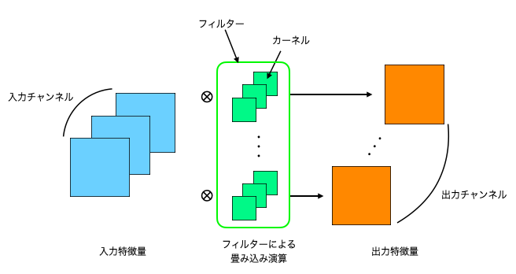

# 畳み込み演算

## Definitions

### カーネル、フィルター

（同じ意味で使われたり表記ゆれがあるので、あくまでも一つの目安）

カーネルとは、一つのチャンネルに対して畳み込み演算に用いられる重みのことで、$D_K\times D_K$ の次元を持っている。カーネルがまとまったものをフィルターと呼ぶ。

### パディング

入力画像のフチをある値で埋める拡張を行う操作。パディングがないと出力される特徴量マップは入力よりもサイズが小さくなる。
パディングを施すことで本来の画像の範囲を超えてカーネルを動かすことができるようになる。

## 概要

- 入力チャンネル：ex. 通常の画像であればRGBの３チャンネル
- 出力チャンネル：用意したカーネルのセットの個数に対応
- 入力チャンネルと対応するカーネルの個数は同じ

## 数式

入力の一つのチャンネルに対する畳み込み演算を式で表すと：
$$
u_{ij} = \sum_{p=0}^{D_K-1}\sum_{q=0}^{D_K-1} x_{i+p-1,j+q-1} \cdot k_{pq}
$$
入力チャンネルを$M$、出力チャンネルを$N$で表すと：
$$
u_{ijn} = \sum_m^M \left( \sum_{p=0}^{D_K-1}\sum_{q=0}^{D_K-1} x_{i+p-1,j+q-1,m} \cdot k_{pqmn} \right)
$$

